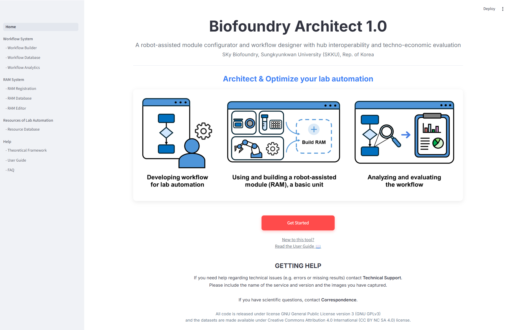
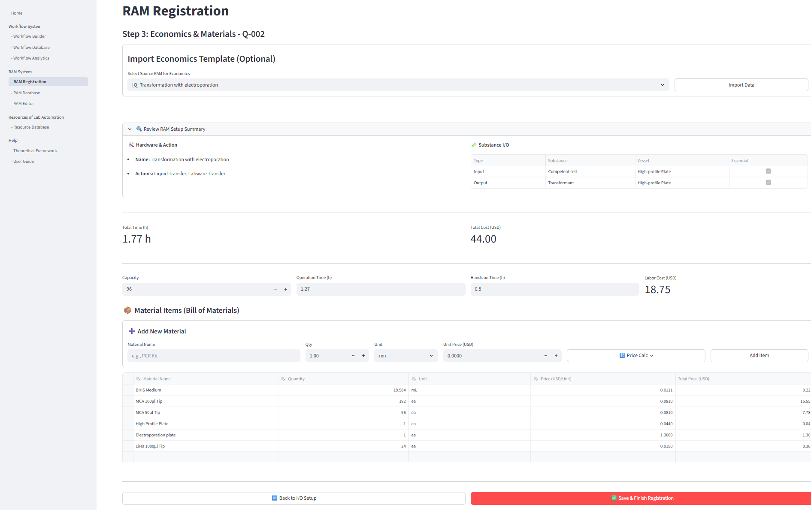
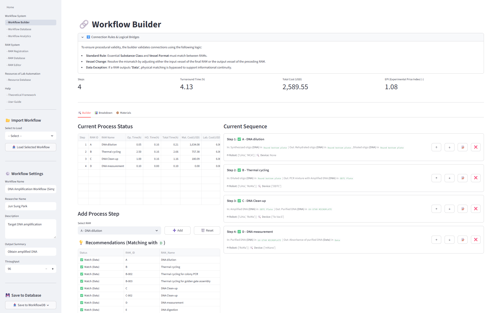
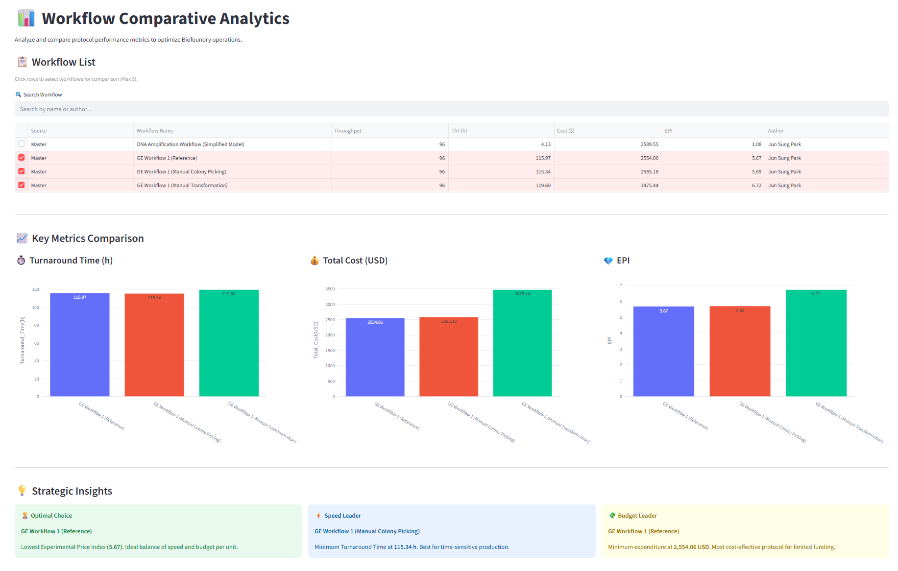

# Biofoundry Architect  
*A web-based platform for RAM-driven workflow design, comparative analytics, and techno-economic simulation*

---

## 🌐 Web Application

Biofoundry Architect is a **web-based platform** for designing, analyzing, and optimizing laboratory automation workflows using a modular framework based on **Robot-Assisted Modules (RAMs)**.

> 🔗 **Access the platform**  
> [Insert your Streamlit link here]



---

## 🧩 Core Capabilities

The platform provides an integrated environment for:

- **RAM construction** (modular experimental units)  
- **Workflow assembly** with constraint-aware validation  
- **Workflow evaluation** using quantitative metrics:
  - Turnaround time (TAT)  
  - Total cost (labor + materials)  
  - Experimental price index (EPI)  
- **Workflow comparative analytics** with automatic insight generation  
- **Resource-constrained loop simulation** for capacity planning  

---

## 🚀 How to Use

### 1. RAM Construction
Define a modular experimental unit including:
- Process actions (e.g., liquid transfer, colony picking)  
- Hardware configuration (robots and functional devices)  
- Substance input/output (I/O)  
- Economic parameters (time, cost, materials)  



---

### 2. Workflow Construction
- Assemble workflows by combining RAMs  
- Automatically validate connections based on:
  - Substance classification  
  - Vessel compatibility  

Invalid configurations are prevented in real time.



---

### 3. Workflow Evaluation
- Compute:
  - Turnaround time (TAT)  
  - Total cost  
  - Experimental price index (EPI)  


---

### 4. Workflow Comparative Analytics

- Select and compare multiple workflows  
- Visualize key metrics:
  - TAT  
  - Total cost  
  - EPI  

- Automatically generate strategic insights:
  - Optimal workflow  
  - Speed leader (minimum TAT)  
  - Budget leader (minimum cost)  

This feature enables **interpretable, data-driven comparison of workflows**, supporting informed decision-making in experimental design.



---

### 5. Loop Simulation (Scaling Analysis)

- Simulate repeated execution of a workflow under resource constraints  
- Define:
  - Budget limit (USD)  
  - Time limit (hours)  

- Automatically compute:
  - Maximum number of executable loops  
  - Budget usage and remaining budget  
  - Time usage and remaining time  

- Identify limiting factors (e.g., budget vs. time)

This feature enables **capacity planning and resource-constrained optimization** of laboratory workflows.


---

## 🏗️ System Overview

- **Frontend**: Streamlit  
- **Backend**: Google Sheets (cloud-based database)  

### Data Architecture
- RAMs and workflows are stored as structured records  
- Serialized fields:
  - `io_data` (substance input/output)  
  - `material_data` (bill of materials)  

This structure enables consistent representation and interoperability across workflows.

A detailed description of the data model and architecture is provided in the Supplementary Information.

---

## 🔐 Data Management & Access Control

- **Master Code**: administrative control  
- **User Access Codes**:
  - Data ownership protection  
  - Quota-based usage control  
- **Guest Mode**:
  - Limited registrations  
  - No ownership protection  

This lightweight mechanism enables collaborative use without full authentication infrastructure.

---

## 📦 Reproducibility & Data Export

All workflows are stored in structured formats, enabling reproducibility:

- Includes:
  - RAM sequence  
  - I/O relationships  
  - Hardware configuration  
  - Techno-economic parameters  

- Export supported in:
  - JSON  
  - Spreadsheet (XLSX-compatible)
  - txt

Representative exported data are provided in Supplementary Data.

---

## ⚙️ Local Deployment (Optional)

Although designed for web use, the platform can be run locally.

### Requirements
- Python 3.9+
- streamlit
- pandas
- gspread / Google Sheets API

### Install
```bash
pip install -r requirements.txt
```

## Configuration (Optional)

This repository is configured to work with a private Google Sheets backend.

Direct execution of the application requires access to the original service account credentials, which are not publicly shared.

To run the application independently, users must configure their own Google Sheets backend and provide corresponding credentials via `.streamlit/secrets.toml`.

## 📄 Manuscript

This repository accompanies the manuscript:

*Biofoundry Architect 1.0: a robot-assisted module configurator and workflow designer with hub interoperability and techno-economic evaluation*  
Submitted to *Bioinformatics* (Application Note)

Supplementary materials include:
- Ontology-based RAM representation  
- System architecture  
- Example workflow construction and evaluation  

---

## 📬 Contact

For access codes or inquiries:

- Email: skybiofoundry@gmail.com
